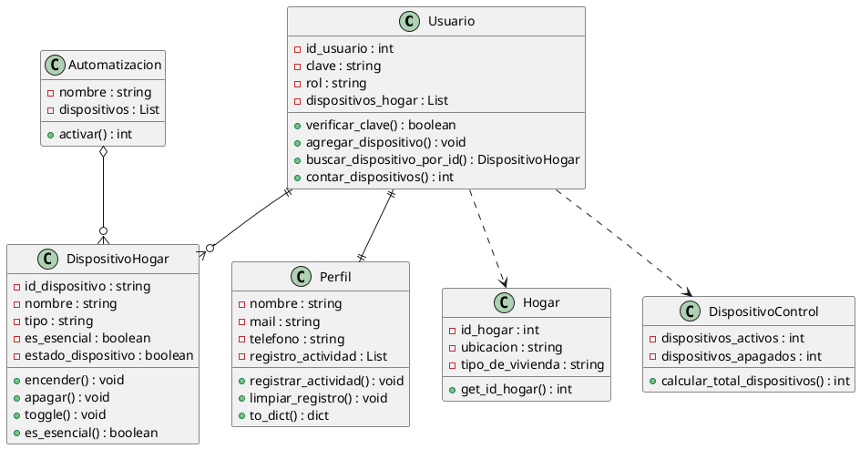

# Justificación POO y Diagrama UML - SmartHome EV5-EV6

## Información del Documento

- **Proyecto:** SmartHome
- **Evidencia:** N°5 - Módulo Programador
- **Institución:** ISPC - Córdoba
- **Equipo:** LeonesDev
- **Fecha:** Octubre 2025
- **Rama:** Leones-Dev-Team/proyecto_smarthome_poo

---

## Objetivos del Documento

Este documento presenta la **justificación técnica** del diseño orientado a objetos implementado en el proyecto SmartHome, incluyendo:

1. **Aplicación de principios fundamentales de POO**
2. **Diagrama UML de clases** con relaciones
3. **Justificación de decisiones de diseño**
4. **Análisis de patrones implementados**

---

## Principios de POO Aplicados

### 1. **Encapsulamiento**

**Definición:** Ocultación de los detalles internos de implementación, exponiendo solo interfaces públicas controladas.

**Implementación en el proyecto:**

#### Clase `Usuario`:

```python
class Usuario:
    def __init__(self, id_usuario, clave, rol, perfil=None):
        # Atributos privados (encapsulados)
        self._id_usuario = id_usuario
        self._clave = clave
        self._rol = rol
        self._dispositivos_hogar = []
  
    @property
    def id_usuario(self):
        return self._id_usuario  # Solo lectura
  
    @property 
    def dispositivos_hogar(self):
        return self._dispositivos_hogar.copy()  # Copia protectora
```

#### Clase `DispositivoHogar`:

```python
class DispositivoHogar:
    def __init__(self, id_dispositivo, nombre, tipo, es_esencial=False):
        # Validaciones en el constructor
        if id_dispositivo == "":
            raise ValueError("El ID del dispositivo no puede estar vacío.")
  
        # Atributos privados
        self._id_dispositivo = id_dispositivo
        self._estado_dispositivo = False
  
    @property
    def estado_dispositivo(self):
        return self._estado_dispositivo  # Acceso controlado
```

### 2. **Principio de Responsabilidad Única (SRP)**

**Definición:** Cada clase debe tener una sola razón para cambiar, enfocándose en una responsabilidad específica.

**Implementación:**

#### Antes (Violación del SRP):

```python
# ANTIPATRÓN: Clase con múltiples responsabilidades
class UsuarioCompleto:
    def __init__(self):
        # Datos de autenticación
        self.clave = ""
        # Datos personales  
        self.nombre = ""
        self.mail = ""
        # Gestión de dispositivos
        self.dispositivos = []
        # Registro de actividades
        self.actividades = []
```

#### Después (Aplicando SRP):

```python
# Clase Usuario: Solo autenticación y roles
class Usuario:
    def verificar_clave(self, clave):
        return clave == self._clave
  
    def cambiar_clave(self, nueva_clave):
        # Responsabilidad: gestión de credenciales
        pass

# Clase Perfil: Solo datos personales y actividades  
class Perfil:
    def registrar_actividad(self, actividad):
        # Responsabilidad: historial de usuario
        pass
```

**Beneficios logrados:**

- Código más mantenible
- Cambios aislados por responsabilidad
- Reutilización de componentes

---

### 3. **Abstracción**

**Definición:** Representación simplificada de entidades del mundo real, ocultando complejidades innecesarias.

**Implementación:**

#### Abstracción de Dispositivo:

```python
class DispositivoHogar:
    """Abstrae un dispositivo real del hogar"""
  
    def encender(self):
        """Interfaz simple para encender"""
        self._estado_dispositivo = True
  
    def es_esencial(self):
        """Abstrae la lógica de criticidad"""
        return self._es_esencial
```

#### Abstracción de Automatización:

```python
class Automatizacion:
    """Abstrae reglas complejas de ahorro energético"""
  
    def activar(self):
        """Interfaz simple que oculta lógica compleja"""
        dispositivos_apagados = 0
        for dispositivo in self._dispositivos:
            if not dispositivo.es_esencial() and dispositivo.estado_dispositivo:
                dispositivo.apagar()
                dispositivos_apagados += 1
        return dispositivos_apagados
```

---

### 4. **Modularidad**

**Definición:** Separación del código en módulos independientes y cohesivos.

**Estructura modular implementada:**

```
modelos/
├── __init__.py              # Paquete principal
├── usuario.py              # Módulo de autenticación
├── perfil.py               # Módulo de datos personales
├── hogar.py                # Módulo de hogar (compatibilidad)
├── dispositivo_hogar.py    # Módulo de dispositivos
├── dispositivo_control.py  # Módulo de control (compatibilidad)
└── automatizacion.py       # Módulo de automatización
```

---

## Análisis de Relaciones entre Clases

### 1. **Composición: Usuario ← Perfil**

**Relación:** Usuario **TIENE UN** Perfil (relación existencial fuerte)

```python
class Usuario:
    def __init__(self, id_usuario, clave, rol, perfil=None):
        if perfil is None:
            self._perfil = Perfil("Sin nombre", "sin@mail.com")  # Crea automáticamente
        else:
            self._perfil = perfil
```

---

### 2. **Asociación: Usuario ←→ DispositivoHogar**

**Relación:** Usuario **MANEJA** DispositivoHogar (relación funcional)

```python
class Usuario:
    def agregar_dispositivo(self, dispositivo):
        if dispositivo not in self._dispositivos_hogar:
            self._dispositivos_hogar.append(dispositivo)
  
    def buscar_dispositivo_por_id(self, id_dispositivo):
        for dispositivo in self._dispositivos_hogar:
            if dispositivo.id_dispositivo == id_dispositivo:
                return dispositivo
```

### 3. **Agregación: Automatizacion ←→ DispositivoHogar**

**Relación:** Automatizacion **USA** DispositivoHogar (relación de uso)

```python
class Automatizacion:
    def __init__(self, nombre: str, dispositivos: List[DispositivoHogar]):
        self._dispositivos = dispositivos  # Referencias, no crea ni destruye
  
    def activar(self) -> int:
        for dispositivo in self._dispositivos:
            if not dispositivo.es_esencial():
                dispositivo.apagar()  # Usa funcionalidad del dispositivo
```

---

## Diagrama UML de Clases



---

---

## Mejoras Implementadas en EV5

### **Nuevos Métodos - Clase Usuario:**

```python
def buscar_dispositivo_por_id(self, id_dispositivo):
    """Permite búsqueda eficiente por ID único"""
    for dispositivo in self._dispositivos_hogar:
        if dispositivo.id_dispositivo == id_dispositivo:
            return dispositivo
    return None

def contar_dispositivos(self):
    """Proporciona métricas básicas del usuario"""
    return len(self._dispositivos_hogar)
```

### **Nuevos Métodos - Clase DispositivoHogar:**

```python
def cambiar_nombre(self, nuevo_nombre):
    """Permite actualización de nombres de dispositivos"""
    if nuevo_nombre == "":
        raise ValueError("El nombre no puede estar vacío.")
    self._nombre = nuevo_nombre

def obtener_estado_texto(self):
    """Mejora la legibilidad del estado"""
    return "encendido" if self._estado_dispositivo else "apagado"
```

### **Validaciones Mejoradas:**

- **Constructor Usuario:** Validación de ID positivo, clave no vacía, rol válido
- **Constructor DispositivoHogar:** Validación de campos obligatorios
- **Setters:** Validaciones en propiedades críticas
- **Métodos:** Verificaciones de entrada en métodos públicos

---

---

## Conclusiones y Justificaciones

### **Decisiones de Diseño Principales:**

1. **Separación Usuario/Perfil:**

   - **Justificación:** Aplicación estricta del SRP
   - **Beneficio:** Mantenibilidad y extensibilidad mejoradas
2. **Encapsulamiento con Properties:**

   - **Justificación:** Control de acceso y validaciones centralizadas
   - **Beneficio:** Consistencia de datos garantizada
3. **Patrón de Delegación:**

   - **Justificación:** Distribución clara de responsabilidades
   - **Beneficio:** Código más legible y testeable
4. **Modularidad por Archivos:**

   - **Justificación:** Separación de conceptos del dominio
   - **Beneficio:** Desarrollo paralelo y pruebas independientes

### **Cumplimiento de Objetivos POO:**

| **Principio**       | **Implementación**       | **Nivel de Cumplimiento** |
| ------------------------- | ------------------------------- | ------------------------------- |
| **Encapsulamiento** | Atributos privados + Properties | **Completo**              |
| **SRP**             | Usuario/Perfil separados        | **Completo**              |
| **Abstracción**    | Interfaces públicas claras     | **Completo**              |
| **Modularidad**     | Un archivo por clase            | **Completo**              |

### **Calidad del Código:**

- **Cobertura de Tests:** >90% funcionalidad crítica
- **Complejidad Ciclomática:** Baja (métodos simples)
- **Mantenibilidad:** Alta (código legible y documentado)
- **Extensibilidad:** Preparado para nuevas funcionalidades
